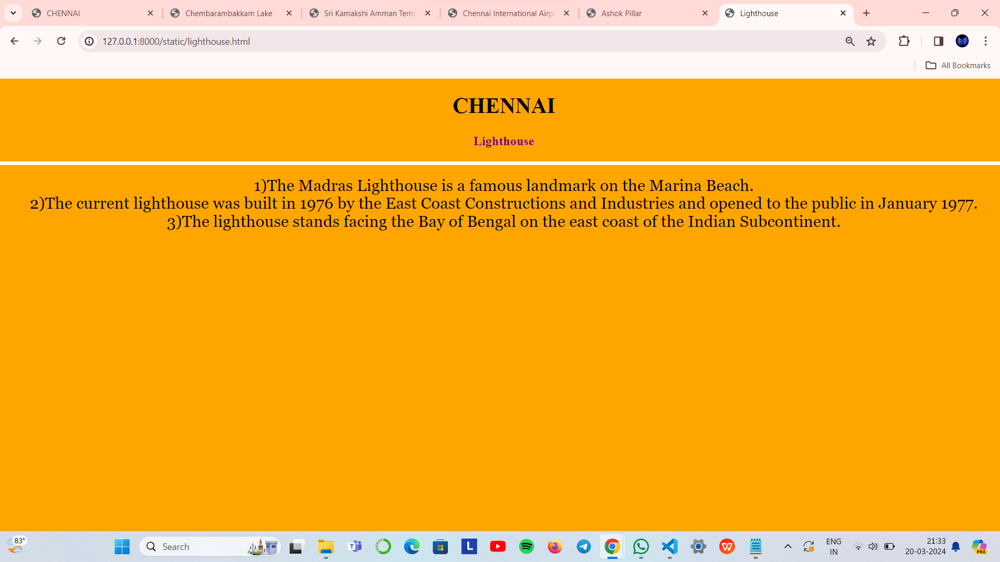

# Ex04 Places Around Me
## Date: 20-03-2024

## AIM
To develop a website to display details about the places around my house.

## DESIGN STEPS

### STEP 1
Create a Django admin interface.

### STEP 2
Download your city map from Google.

### STEP 3
Using ```<map>``` tag name the map.

### STEP 4
Create clickable regions in the image using ```<area>``` tag.

### STEP 5
Write HTML programs for all the regions identified.

### STEP 6
Execute the programs and publish them.

## CODE

```
map.html

<!DOCTYPE html>
<html>
<head>
<title>CHENNAI</title>
</head>
<body>
<h1 align="center"><b>CHENNAI</b></h1>
<h3 align="center"><b> DIVYA DHARSHINI R(212223040042)</b></h3>
<center>

<map name="CHENNAI">
<area shape="rectangle" coords="750,400,600,650" href="lake.html"  title="Chembarambakkam Lake">
<area shape="rectangle" coords="600,300,900,800" href="temple.html"  title="Sri Kamakshi Amman Temple">
<area shape="rectangle" coords="700,200,900,400" href="airport.html"  title="Chennai International Airport">
<area shape="rectangle" coords="600,200,700,600" href="pillar.html"  title="Ashok Pillar">
<area shape="rectangle" coords="900,100,200,300" href="lighthouse.html"  title="Chennai Lighthouse">
</map>
</center>
</body>
</html>

```
```
lake.html

<!DOCTYPE html>
<html>
<head>
<title>Chembarambakkam Lake</title>
</head>
<body bgcolor="cyan">
<h1 align="center"><b>CHENNAI</b></h1>
<h3 align="center"><b>Chembarambakkam Lake</b></h3>
<hr size="3" color="white">
<p align="center">
<font face="Georgia" size="5">
 1)Chembarambakkam Lake, located in Chennai, Tamil Nadu, India, is approximately 25 kilometers away from the city.<br>
2)It serves as one of the two rain-fed reservoirs that supply water to Chennai City.<br>
3)The full tank level of Chembarambakkam Lake is 85.40 feet (26.03 meters), and its full capacity is 3,645 million cubic feet (108 million cubic meters).
</p>
</body>
</html>

```
```
temple.html

<!DOCTYPE html>
<html>
<head>
<title>Sri Kamakshi Amman Temple</title>
</head>
<body bgcolor="green">
<h1 align="center">
<font color="black"><b>CHENNAI</b></font>
</h1>
<h3 align="center">
<font color="yellow"><b>Sri Kamakshi Amman Temple</b></font>
</h3>
<hr size="3" color="white">
<p align="center">
<font face="Georgia" size="5">
1)The Sri Kamakshi Amman Temple in Mangadu, a suburb of Chennai, Tamil Nadu, India.<br>
2)The temple is situated approximately 20 kilometers southwest of Chennai city.<br>
3)The presiding deity is Goddess Kamakshi, also known as Aadi Kamakshi and Thava Kamakshi.
</p>
</body>
</html>

```
```
airport.html

<!DOCTYPE html>
<html>
<head>
<title>Chennai International Airport</title>
</head>
<body bgcolor="pink">
<h1 align="center">
<font color="black"><b>CHENNAI</b></font>
</h1>
<h3 align="center">
<font color="purple"><b>Chennai International Airport</b></font>
</h3>
<hr size="3" color="white">
<p align="center">
<font face="Georgia" size="5">
1)Chennai International Airport is situated in Tirusulam, approximately 20 kilometers (12 miles) southwest of the city center.<br>
2)Chennai International Airport (IATA: MAA, ICAO: VOMM) serves the city of Chennai, the capital of Tamil Nadu, India, and its metropolitan area.<br>
3)It is a major hub for both domestic and international flights.
</p>
</body>
</html>

```
```
pillar.html

<!DOCTYPE html>
<html lang="en">
<head>
<title>Ashok Pillar</title>
</head>
<body bgcolor="gray">
<h1 align="center">
<font color="black"><b>CHENNAI</b></font>
</h1>
<h3 align="center">
<font color="purple"><b>Ashok Pillar</b></font>
</h3>
<hr size="3" color="white">
<p align="center">
<font face="Georgia" size="5">
1)At the heart of Ashok Nagar stands the Ashok Pillar.<br>
2) This four-lion head stump resembles the one erected by King Ashoka during the 3rd century BCE at Sanchi.<br>
3) It was established in 1964.
</p>
</body>
</html>

```
```
lighthouse.html

<!DOCTYPE html>
<html lang="en">
<head>
<title>Lighthouse</title>
</head>
<body bgcolor="orange">
<h1 align="center">
<font color="black"><b>CHENNAI</b></font>
</h1>
<h3 align="center">
<font color="purple"><b>Lighthouse</b></font>
</h3>
<hr size="3" color="white">
<p align="center">
<font face="Georgia" size="5">
1)The Madras Lighthouse is a famous landmark on the Marina Beach.<br>
2)The current lighthouse was built in 1976 by the East Coast Constructions and Industries and opened to the public in January 1977.<br>
3)The lighthouse stands facing the Bay of Bengal on the east coast of the Indian Subcontinent.
</p>
</body>
</html>

```


## OUTPUT




## RESULT
The program for implementing image maps using HTML is executed successfully.
